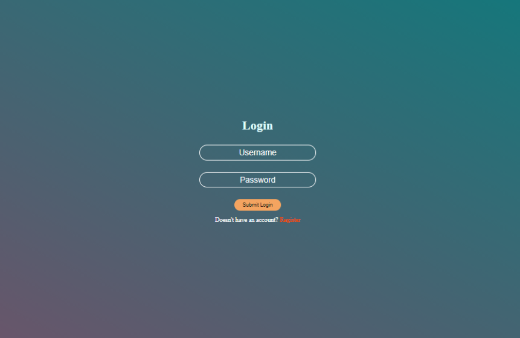
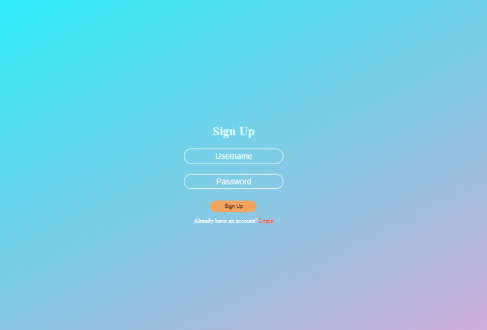
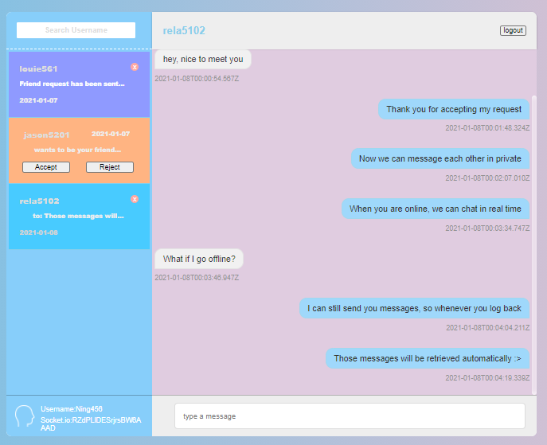

<h1> Chat Web Application </h1>
This is a messaging application based NodeJS/ExpressJS/MongoDB and Sockets applications. This is an application enables clients to send private conversation requests (to be rejected/accepted) to other clients to establish a private one to one conversation.However, a client must be logged in to access the chat features. 

<h2> Instructions To Run </h2>
<ol> 
  <li>Clone this project: https://github.com/chy101010/SimpleChat</li>
  <li>Download MongoDB, execute mongod from its bin in the termination</li>
  <li>Install all dependencies using <ol> <li> npm install </li> <li> npm install nodemon </li> </ol> </li>  
  <li>npm run launch</li>
</ol>

<h5> When the server is ready </h5>
<ol>
  <li>Go to your browswer and search up http://localhost:3000/</li>
  <li>Register an account</li>
  <li>Login with the account created</li>
</ol>

<h3> Login page </h3>

<h3> Register page </h3>

<h3> Chat page </h3>

